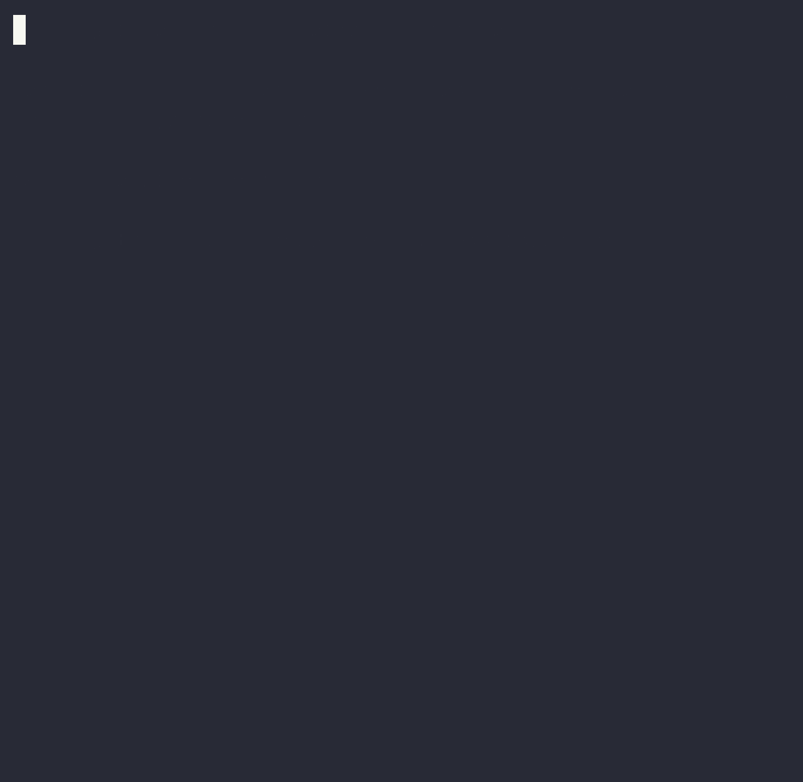

# AlCheck Tour

## 1. ✅ Full run — everything green

A healthy project: `check` runs `format`, `compile`, `compile_test`,
`credo`, `credo_strict`, `dialyzer`, and `test` in parallel — and
finishes by comparing current coverage against the baseline stored on
the `cover_do_not_delete` branch (`baseline_cmd` in `.check.json`). The
footer prints `+X% / -X% / same as baseline` so a regression is visible
at a glance.

## 2. ✅ `--only test` — just the tests, in partitions

`check --only test` runs the test suite alone, partitioned in parallel
per `.check.json`. Useful when you're iterating on test changes.

## 3. ⚠️ `check --fast` — the defects come back

Now we restore the planted defects (`# DEMO:` comments in the lib
sources) and run the fast subset (`format`, `compile`, `credo`). You see
exactly how al_check renders failures: each check fans out, those that
fail flip red, and the failure details follow below.

## 4. ✅ `--coverage` — coverage report + caching

`check --coverage` runs the coverage calculation, merges partition
results, and prints a per-module summary. Re-running with no source
changes hits the cache instead of re-running calcs.

## 5. ✅ `--only modified_tests --repeat 10` — repeat changed tests

The `modified_tests` builtin compares the working tree against the base
branch (set via `"base_branch"` in `.check.json`) and runs only the
test lines that changed. `--repeat 10` re-runs those tests up to 10
times via `mix test --repeat-until-failure`, useful for hunting flakes.
Quiet output here just means nothing has changed relative to `main`; if
nothing's modified, there's nothing to repeat.

## 6. ✅ `--partitions 5` — split the test suite

`--only test --partitions 5` splits the suite across 5 OS processes
running in parallel. Per-partition logs land in `.check/`.

## 7. ✅ `--verbose` — stream raw test output

By default al_check captures test output and prints only summaries.
`--verbose` lets `mix test` write straight to the terminal.

## Caveats

* **First-time dialyzer is slow** — the PLT build can take a few
  minutes. The recorder script warms the PLT before the green casts so
  the playback stays snappy.
* **`--watch` is best run live in a terminal** alongside running tests:
  `check --only test` in terminal 1, `check --watch` in terminal 2.
